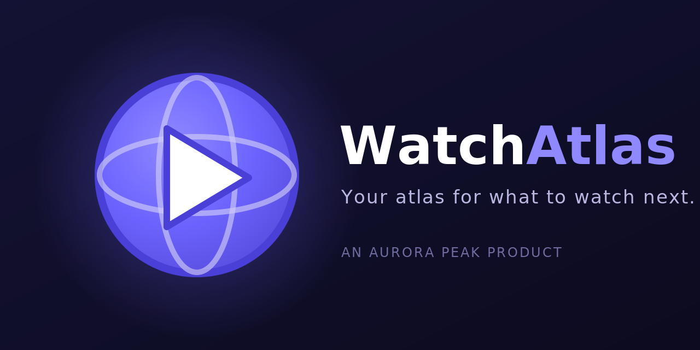

<p align="center">
  
</p>

<p align="center">
  <em>Your atlas for what to watch next.</em>
</p>

<p align="center">
  
  
  
  
  
  
</p>

---

## About

**WatchAtlas** is a movie and TV discovery app that helps you find your next watch and keep track of it. Browse what's trending, dig into the details of any title, and save the ones you care about to a personal list that follows you across devices.

Built and maintained by [Aurora Peak](https://github.com/aurora-peak).

## Features

- **Discover** — browse trending and popular movies and TV shows on a single, streamlined home screen.
- **Title details** — rich detail pages for every title, powered by [TMDB](https://www.themoviedb.org/).
- **Your watchlist** — save titles to a personal list synced to your account.
- **Sign in with Google** — quick, secure authentication via Firebase.
- **Light & dark themes** — the whole app adapts to your preference.
- **Fast & fluid** — smooth transitions and a responsive layout that works on phone, tablet, and desktop.

## Tech Stack

| Layer | Tooling |
|-------|---------|
| Framework | Next.js 14 (Pages Router), React 18, TypeScript |
| UI | NextUI, Tailwind CSS, Framer Motion, Heroicons / Lucide |
| State | Zustand |
| Auth & Data | Firebase (Auth + Firestore), Google OAuth |
| Content | TMDB API |
| Theming | next-themes |
| Hosting | Vercel (with scheduled cron jobs) |

## Getting Started

### Prerequisites

- Node.js 18 or newer
- A [TMDB API key](https://www.themoviedb.org/settings/api)
- A [Firebase project](https://console.firebase.google.com/) with Authentication enabled

### Setup

```bash
# 1. Clone the repo
git clone https://github.com/aurora-peak/watchatlas-web.git
cd watchatlas-web

# 2. Install dependencies
npm install

# 3. Configure environment variables
cp .env.local.example .env.local
# then open .env.local and fill in your own keys (see below)

# 4. Run the dev server
npm run dev
```

Open [http://localhost:3000](http://localhost:3000) to view the app.

### Environment variables

Create a `.env.local` file based on `.env.local.example` and supply your **own** values:

```env
NEXT_PUBLIC_TMDB_API_KEY=your_tmdb_api_key
NEXT_PUBLIC_FIREBASE_API_KEY=your_firebase_api_key
NEXT_PUBLIC_FIREBASE_AUTH_DOMAIN=your_project.firebaseapp.com
NEXT_PUBLIC_FIREBASE_PROJECT_ID=your_project_id
NEXT_PUBLIC_FIREBASE_STORAGE_BUCKET=your_project.appspot.com
NEXT_PUBLIC_FIREBASE_MESSAGING_SENDER_ID=your_sender_id
NEXT_PUBLIC_FIREBASE_APP_ID=your_app_id
NEXT_PUBLIC_GOOGLE_CLIENT_ID=your_google_oauth_client_id
```

> **Never commit real secrets.** Keep `.env.local` out of version control (it's already gitignored) and manage production values through your host's environment/secret store.

## Scripts

| Command | Description |
|---------|-------------|
| `npm run dev` | Start the local development server |
| `npm run build` | Create a production build |
| `npm run start` | Run the production build locally |
| `npm run test` | Run the test suite |

## Project Structure

```
watchatlas-web/
├── pages/          # Routes (home, title details, settings) + API routes
│   ├── api/        # Server-side endpoints (TMDB proxy, scheduled jobs)
│   └── details/    # Title detail pages
├── components/     # Reusable UI components
├── lib/            # Helpers, API clients, and app logic
├── styles/         # Global styles and Tailwind config
├── types/          # Shared TypeScript types
└── public/         # Static assets (logo, icons)
```

## Deployment

WatchAtlas is deployed on **Vercel**. Connect the repo, add the environment variables above in the Vercel dashboard, and every push to `main` ships to production.

## Attribution

This product uses the TMDB API but is not endorsed or certified by TMDB.

---

<p align="center"><sub>An <a href="https://github.com/aurora-peak">Aurora Peak</a> product · Proudly built in the PNW.</sub></p>
